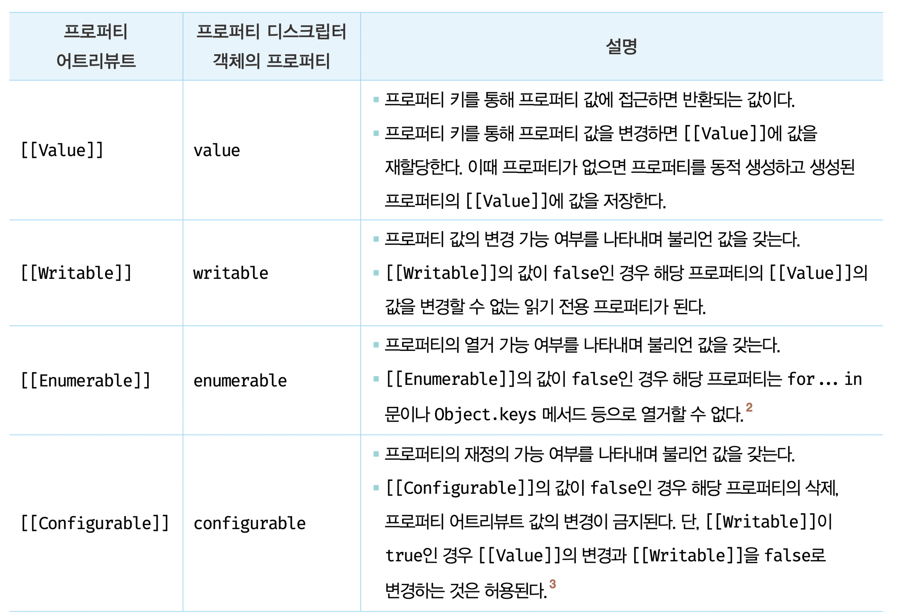
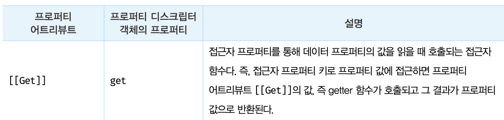
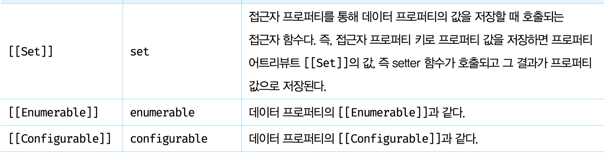

# 내용정리
## 내부 슬롯과 내부 메서드
- ECMAScript 사양에 등장하는 이중 대괄호로 감싼 이름들이 내부 슬롯과 내부 메서드다.
- 자바스크립트 엔진의 내부 로직이므로 직접 접근하거나 호출할 수 있는 방법을 제공하지 않음.
- 단, 일부 한하여 간접적으로 접근할 수 있는 수단 제공

## 프로퍼티 어트리뷰트와 프로퍼티 디스크립터 객체
- 자바스크립트 엔진은 프로퍼티를 생성할 때 프로퍼티의 상태를 나타내는 프로퍼티 어트리뷰트를 기본값으로 자동 정의함.
- 프로퍼티의 상태란 프로퍼티의 값, 값의 갱신 가능 여부, 열거 가능 여부, 재정의 가능 여부를 말함.
- 프로퍼티 어트리뷰트는 자바 스크립트 엔진이 관리하는 내부 상태 값인 내부 슬롯 [[Value]], [[Writable]], [[Enumerable]], [[Configurable]]이다.
- 프로퍼티 어트리뷰트에 직접 접근할 수 없지만 Object.getOwnPropertyDescriptor 메서드를 사용해 간접적으로 확인 할 순 있음.
``` js
const person = {
    name: 'Oh';
};

// 프로퍼티 어트리뷰트 정보를 제공하는 프로퍼티 디스크립터 객체를 반환
console.log(Object.getOwnPropertyDescriptor(person, 'name'));
// { value: 'Oh', writable: true, enumerable: true, configurable: true }
```
- getOwnPropertyDescriptor 메서드의 첫 매개변수에는 객체의 참조를 전달, 두번째 매개변수에 프로퍼티 키를 문자열로 전달
- Object.getOwnPropertyDescriptor는 프로퍼티 어트리뷰트 정보를 제공하는 프로퍼티 디스크립터 객체를 반환
- Object.getOwnPropertyDescriptor는 하나의 프로퍼티에 대해 객체를 반환하지만 ES8에 도입된 Object.getOwnPropertyDescriptors 메서드는 모든 프로퍼티의 프로퍼티 어트리뷰트 정보를 제공.


## 데이터 프로퍼티와 접근자 프로퍼티
- 데이터 프로퍼티
  - 키와 값으로 구성된 일반적인 프로퍼티
- 접근자 프로퍼티
  - 자체적으로 값ㅇ르 갖지 않고 달느 데이터 프로퍼티의 값을 읽거나 저장할 때 호출되는 접근자 함수로 구성된 프로퍼티

### 데이터 프로퍼티
- 자바스크립트 엔진이 프로퍼티를 생성할 떄 기본값으로 자동 정의됨

- 프로퍼티가 생성될 때 [[Value]]의 값은 프로퍼티 값으로 초기화 되며 나머지 값은 true로 초기화됨

### 접근자 프로퍼티
- 접근자 함수로 구성된 프로퍼티
- 다음 어트리뷰트를 갖음


- 접근자 프로퍼티는 getter와 setter 함수를 정의할 수 있음
``` js 
const person = {
    firstName: 'SEJIN',
    lastName: 'OH',
    get fullName() {
        return `${this.firstName} ${this.lastName}`;
    },
    set fullName(name) {
        [this.firstName, this.lastName] = name.split(' ');
    }
};

// 접근자 프로퍼티를 통한 저장. setter 함수 호출됨
person.fullName = 'JINI OH';

// 접근자 프로퍼티 getter 함수가 호출
console.log(person.fullName);

let descriptor = Object.getOwnPropertyDescriptor(person, 'firstName');
// { value: 'JINI', writable: true, enumerable: true, configurable: true }
console.log(descriptor);

descriptor = Object.getOwnPropertyDescriptor(person, 'fullName');
//{ get: [Function: get fullName], set: [Function: set fullName], enumerable: true, configurable: true}
console.log(descriptor);
```
- 접근자 프로퍼티 fullName으로 프로퍼티에 값에 접근하면 내부적으로 [[Get]] 내부 메서드가 호출
- 접근자 프로퍼티와 데이터 프로퍼티의 프로퍼티 디스크립터 객체의 프로퍼티는 다르다

## 프로퍼티 정의
- 프로퍼티 정의란 새로운 프로퍼티를 추가하면서 프로퍼티 어트리뷰트를 명시적으로 정의하거나, 기존 프로퍼티의 프로퍼티 어트리뷰트를 재정의 하는 것을 말함.
- Object.defindeProperty를 사용하면 프로퍼티의 어트리뷰트를 정의할 수 있음. 
``` js
const person = {};

Object.defineProperty(person, 'firstName', {
    value: 'SEJIN',
    writable: true,
    enumerable: true,
    configurable: true
});

Object.defineProperty(person, 'lastName', {
    value: 'OH'
});

// 접근자 프로퍼티 정의
Object.defineProperty(person, 'fullName', {
    // getter
    get() {
        return `${this.fullName} ${this.lastName}`;
    },
    // setter
    set(name) {
        [this.firstName, this.lastName] = name.split(' ');
    },
    enumerable: true,
    configurable: true
});
```

## 객체 변경 방지
- 자바스크립트는 객체의 변경을 방지하는 다양한 메서드 제공


### 객체 확장 금지
- Object.preventExtensions 메서드로 처리. 
- 확장이 금지된 객체는 프로퍼티 추가가 금지됨.

### 객체 밀봉
- Object.seal
- 밀봉된 객체는 읽기와 쓰기만 가능
- 프로퍼티 추가 및 삭제, 재정의 금지

### 객체 동결
- Object.freeze
- 동결된 객체는 읽기만 가능

### 불변 객체
- 객체의 중첩 객체까지 동결하여 변경이 불가능한 읽기 전용 불변 객체를 구현하려면 객체를 값으로 갖는 모든 프로퍼티에 대해 재귀적으로 Object.freeze를 호출해야 함


# 추가정리