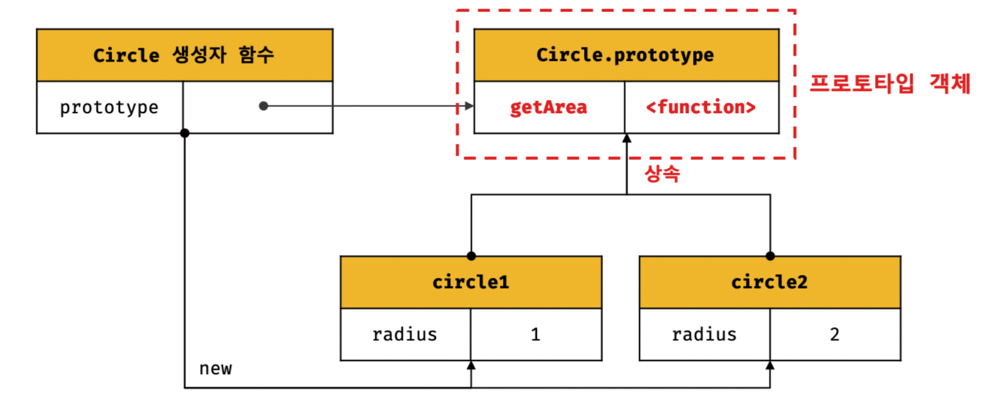
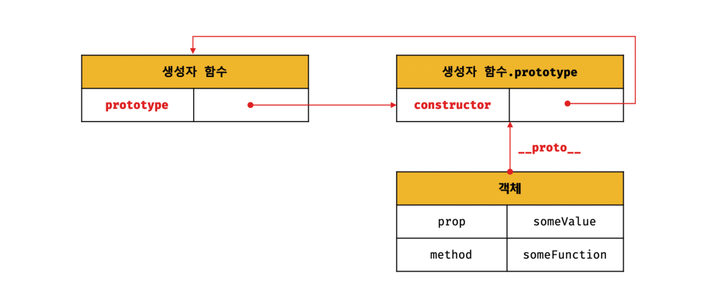
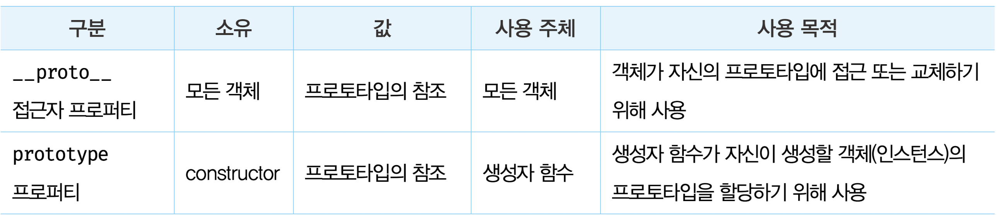
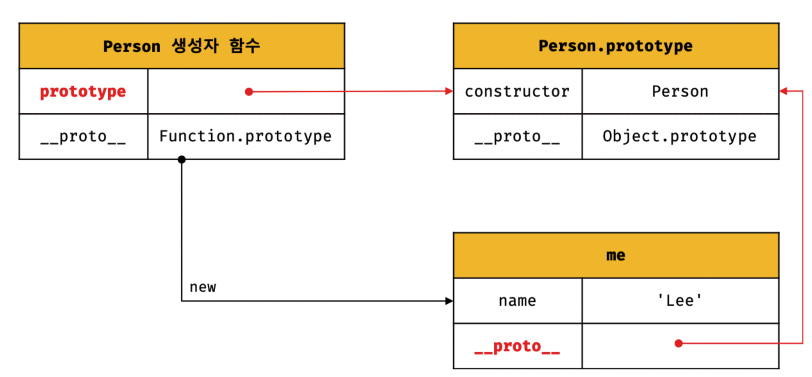
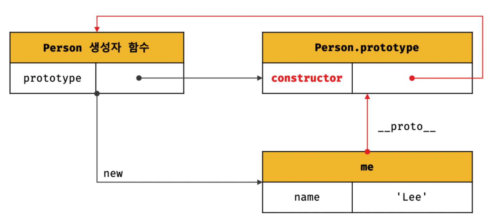

# 내용정리
## 상속과 프로토타입
- 자바스크립트는 프로토타입을 기반으로 상속을 구현하여 불필요한 중복을 제거한다
``` js
function Circle(radius) {
    if (!new.target) {
        return new Circle(radius);
    }

    this.radius = radius;
    this.getDiameter = function() {
        return 2 * this.radius;
    };
}

const circle1 = new Circle(1);
const circle2 = new Circle(2);
console.log(circle1.getArea === circle.getArea) // false
```
- 위 생성자 함수에는 문제가 있다.
- Circle 생성자 함수가 생성하는 모든 인스턴스는 radius 프로퍼티와 getArea 메서드를 갖는다.
- radius는 인스턴스마다 다르다. 하지만 getArea 메서드는 모든 인스턴스가 동일한 내용을 사용하므로 모든 인스턴스가 공유해 사용하는 것이 바람직.
- 자바스크립트는 프로토타입을 기반으로 상속을 구현한다.
``` js
function Circle(radius) {
    this.radius = radius;
}

Circle.prototype.getArea = function() {
    return Math.PI * this.radius **2;
}

const circle1 = new Circle(1);
const circle2 = new Circle(2);
console.log(circle1.getArea === circle.getArea) // true
```
- Circle 생성자 함수가 생성한 모든 인스턴스는 자신의 프로토타입, 즉 상위 객체 역할을 하는 Circle.prototytpe의 모든 프로퍼티와 메서드를 상속받는다.
- 자신의 상태를 나타내는 radius 프로퍼티만 개별적으로 소유하고 내용이 동일한 메서드는 상속을 통해 공유하여 사용.


## 프로토타입 객체
- 프로토타입 객체란 객체지향 프로그래밍의 근간을 이루는 객체 간 상속을 구현하기 위해 사용됨.
- 프로토타입은 어떤 객체의 상위 객체의 역할을 하는 객체로서 다른 객체에 공유 프로퍼티를 제공.
- 모든 객체는 [[Prototype]]이라는 내부 슬롯을 가지며, 이 내부 슬롯의 값은 프로토타입의 참조다.
- 객체가 생성될 때 객체 생성 박식에 따라 프로토타입이 결정되고 [[Prototype]]에 저장됨.
- 모든 객체는 하나의 프로토타입을 갖는다.
- 그리고 모든 프로토타입은 생성자 함수와 연결되어 있다.

- __proto__ 접근자 프로퍼티를 통해 자신의 프로토타입, 즉 자신의 [[Prototype]] 내부 슬롯이 가리키는 프로토타입에 간접적으로 접근 가능.
- 그리고 프로토타입은 자신의 constructor 프로퍼티를 통해 생성자 함수에 접근할 수 있고, 생성자 함수는 자신의 prototype 프로퍼티를 통해 프로토타입에 접근할 수 있다.

### __proto__ 접근자 프로퍼티
- 모든 객체는 - __proto__ 접근자 프로퍼티를 통해 자신의 프로토타입, 즉 자신의 [[Prototype]] 내부 슬롯이 가리키는 프로토타입에 간접적으로 접근 가능.
- __proto__는 접근자 프로퍼티다
  - 접근자 프로퍼티는 자체적으로는 값([[Value]] 프로퍼티 어트리뷰트)을 갖지 않고 다른 데이터 프로퍼티의 값을 읽거나 저장할 떄 사용하는 접근자 함수, 즉 [[Get]], [[Set]] 프로퍼티 어트리뷰트로 구성된 프로퍼티다.
  - __proto__ 접근자 프로퍼티를 통해 프로토타입에 접근하면 내부적으로 __proto__ 접근자 프로퍼티의 getter 함수인 [[Get]]이 호출됨.
  - __proto__ 접근자 프로퍼티를 통해 새로운 프로토타입을 할당하면 __proto__ 접근자 프로퍼티의 setter 함수인 [[Set]]이 호출됨.
- __proto__ 접근자 프로퍼티는 상속을 통해 사용된다
  - __proto__ 접근자 프로퍼티는 객체가 직접 소유하는 프로퍼티가 아니라 Object.prototype의 프로퍼티다.
  - 모든 객체는 상속을 통해 Object.prototype.__proto__ 접근자 프로퍼티를 사용할 수 있다.
  - __proto__는 접근자 함수([[Get]], [[Set]])를 통해 프로토타입을 취득하거나 할당한다.
  - __proto__ 접근자 프로퍼티는 상속을 통해 사용된다
    - __proto__ 접근자 프로퍼티는 객체가 직접 소유하는 프로퍼티가 아니라 Object.prototype의 프로퍼티다
    ``` js
    const person = {name: 'OH'};
    console.log(person.hasOwnProperty('__proto__')); // false
    console.log({}.__proto__ === Object.prototype); // true
    ```
  - __proto__ 접근자 프로퍼티를 통해 프로토타입에 접근하는 이유
    - 상호 참조에 의해 프로토타입 체인이 생성되는 것을 방지하기 위함
    - 프로토 타입 체인은 단방향 링크드 리스트로 구현되어야 한다.
    - 순환참조가 일어나지 않도록 __proto__ 접근자 프로퍼티를 통해 프로토타입에 접근하고 교체하도록 구현되어 있다.
    ``` js
    const parent = {};
    const child = {};
    chid.__proto__ = parent;
    parent.__proto__ = cild; // Type Error: Cyclic __proto__ value
    ```
  - __proto__ 접근자 프로퍼티를 코드 내에서 직접 사용하는 것은 권장하지 않는다. 
    - __proto__ 접근자 프로퍼티 대신 프로토타입의 참조를 취득하고 싶은 경우에 Object.getPrototypeOf 메서드를 사용하고, 프로토타입을 교체하고 싶은 경우 Object.setProtoypeOf 메서드를 사용할 것을 권장.
    ``` js
    const ob = {};
    const parent = {x:1};

    Object.getPrototypeOf(obj); // obj.__proto__
    Object.setPrototypeOf(obj, parent); // obj.__proto__ = parent;
    console.log(obj.x); // 1
    ```

### 함수 객체의 prototype 프로퍼티
- 함수 객체만이 소유하는 prototype 프로퍼티는 생성자 함수가 생성할 인스턴스의 프로토타입을 가리킴
``` js
// 함수 객체는 prototype 프로퍼티를 소유
(function () {}).hasOwnProperty('prototype'); // true
// 일반 객체는 prototype 프로퍼티 소유x
({}).hasOwnProperty('prototype');  // false
```
- 생성자 함수로서 호출할 수 없는 함수, 즉 non-constructor인 화살표 함수와 ES6 메서드 축약 표현으로정의한 메서드는 prototype 프로퍼티를 소유하지 않으며 프로토타입도 생성하지 않음.
- 일반함수는 prototype 프로퍼티를 소유하지만 객체를 생성하지 않는 일반 함수의 prototype 프로퍼티는 아무런 의미가 없음.
- 모든 객체가 가지고 있는 __proto__ 접근자 프로퍼티와 함수 객체만이 가지고 있는 prototype 프로퍼티는 결국 동일한 프로토타입을 가리킴. 하지만 이들 프로퍼티를 사용하는 주체가 다름.

``` js
function Person(name) {
    this.name = name;
}
const me = new Person('Oh');
console.log(Person.prototype === me.__proto__);
```


### 프로토타입의 constructor 프로퍼티와 생성자 함수
- 모든 프로토타입은 constructor 프로퍼티를 갖는다.
- 이 constructor 프로퍼티는 prototype 프로퍼티로 자신을 참조하고 있는 생성자 함수를 가리킴.
- 이 연결은 생성자 함수가 생성될 떄, 즉 함수 객체가 생성될 때 이루어짐.
``` js
function Person(name) {
    this.name = name;
}
const me = new Person('Oh');
console.log(me.constructor === Person);
```

- me 객체는 프로토타입의 constructor 프로퍼티를 통해 생성자 함수와 연결됨.
- me 객체에 constructor 프로퍼티가 없지만 me 객체의 프로토타입인 Person.prototype에는 constructor 프로퍼티가 있음.
- 따라서 me 객체는 프로토타입인 Person.prototype의 constructor 프로퍼티를 상속받아 사용

## 리터럴 표기법에 의해 생성된 객체의 생성자 함수와 프로토타입 (다시)
- 리터럴 표기법에 의해 생성된 객체도 프로토타입이 존재
- 하지만 리터럴 표기법에 의해 생성된 객체의 경우 프로토타입의 constructor 프로퍼티가 가리키는 생성자 함수가 반드시 객체를 생성한 생성하 함수라 단전할 순 없음.
- Object 생성자 함수에 인수를 전달하지 않거나 undefinded 또는 null을 인수로 전달하면서 호출하면 내부적으로는 추상 연산 OrdinaryObjectCreate를 호출해 Object.prototype을 프로토타입으로 갖는 빈 객체를 생성.
- 다시

## 프로포타입의 생성 시점
- 프로토타입은 생성자 함수가 생성되는 시점에 더불어 생성됨.

### 사용자 정의 생성자 함수와 프로토타입 생성 시점 (다시)
- 생성자 함수로서 호출할 수 있는 함수, 즉 constructor는 함수 정의가 평가되어 함수 객체를 생성하는 시점에 프로토타입도 더불어 생성됨
``` js
console.log(personalbar.prototype);

function Person(name) {
    this.name = name;
}
```
- 함수 선언문은 런타임 이전에 자바스크립트 엔진에 의해 먼저실행되서 함수 선언문으로 정의된 Person 생성자 함수는 어떤 코드보다 먼저 평가되어 함수 객체가 됨.
- 이때 프로토타입도 더불어 생성됨.
- 생성된 프로토타입은 Person 생성자 함수의 prototype 프로퍼티에 바인딩됨.
- 생성된 프로토타입은 오직 constructor 프로퍼티만을 갖는 객체.
- 다시

# 추가정리